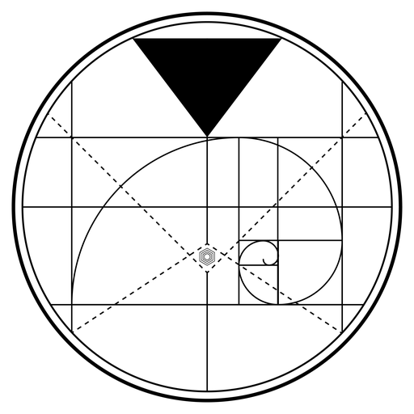
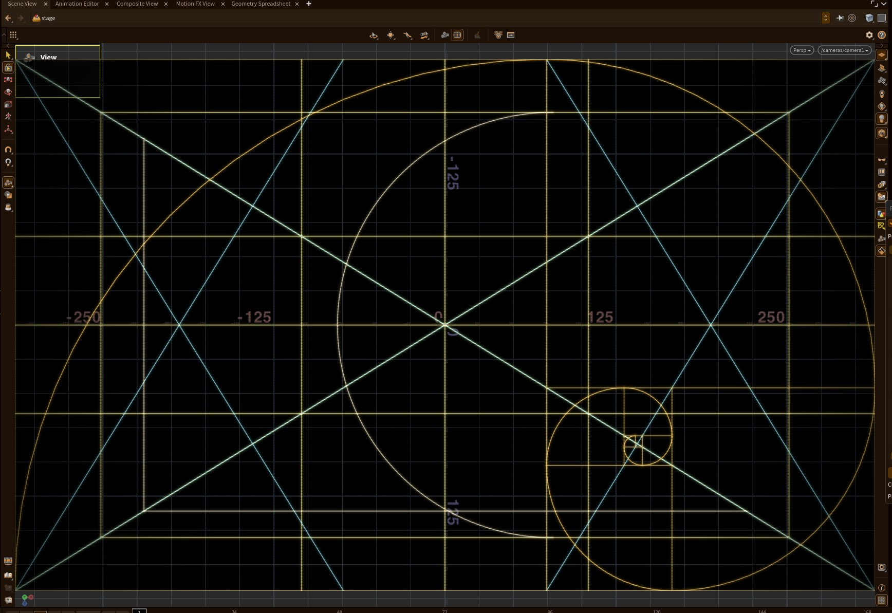
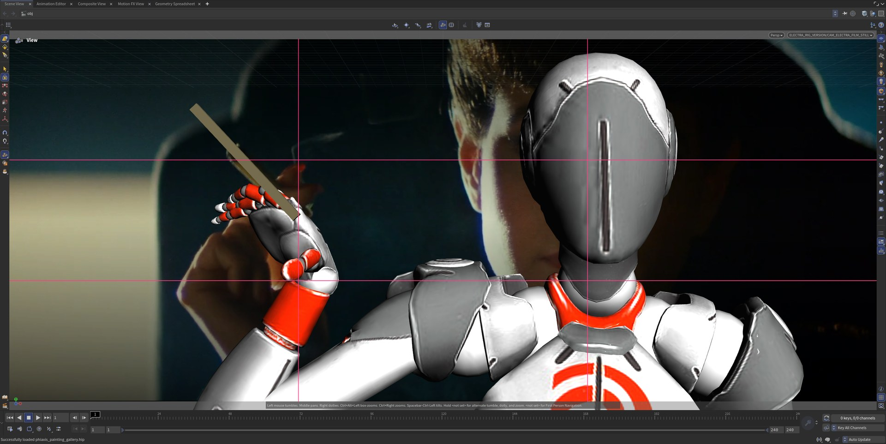
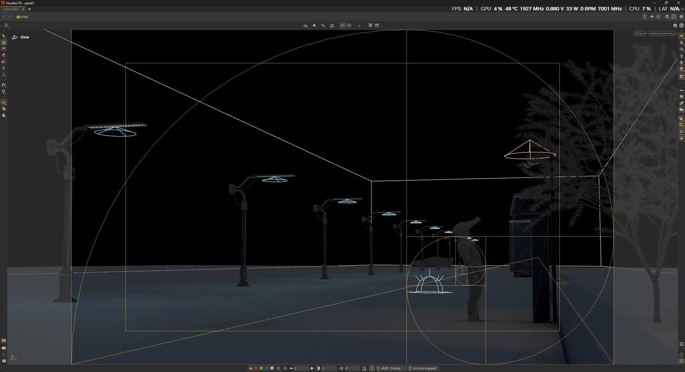
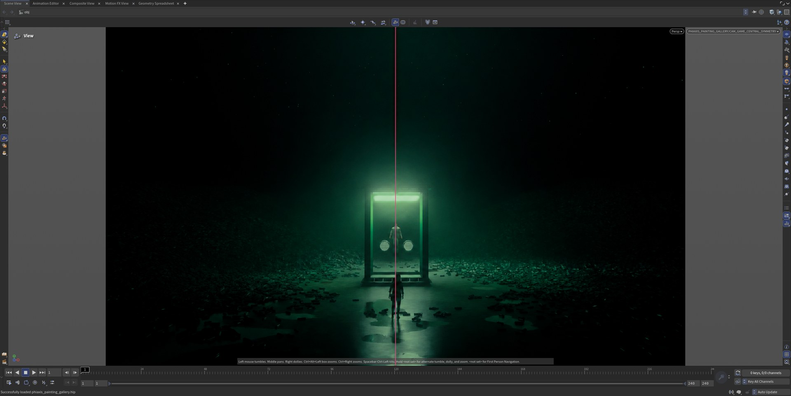
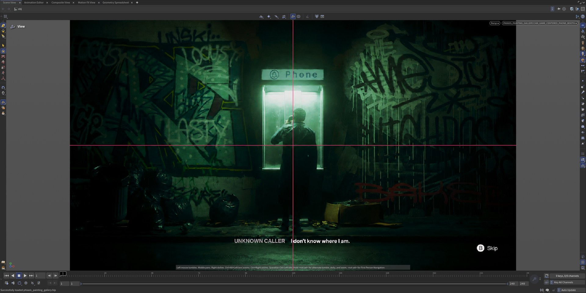
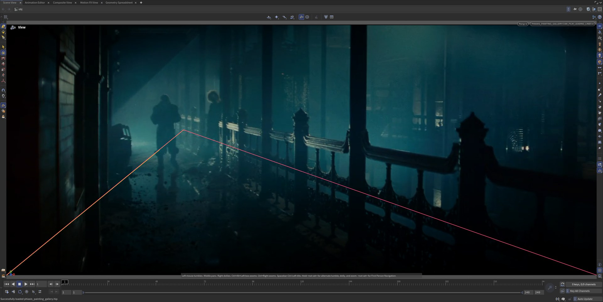
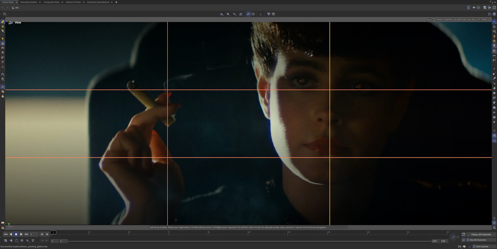
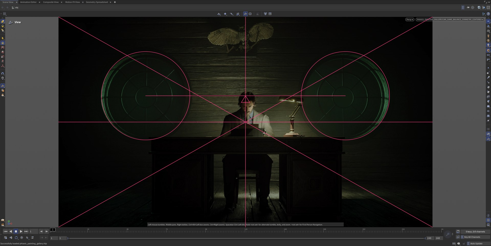
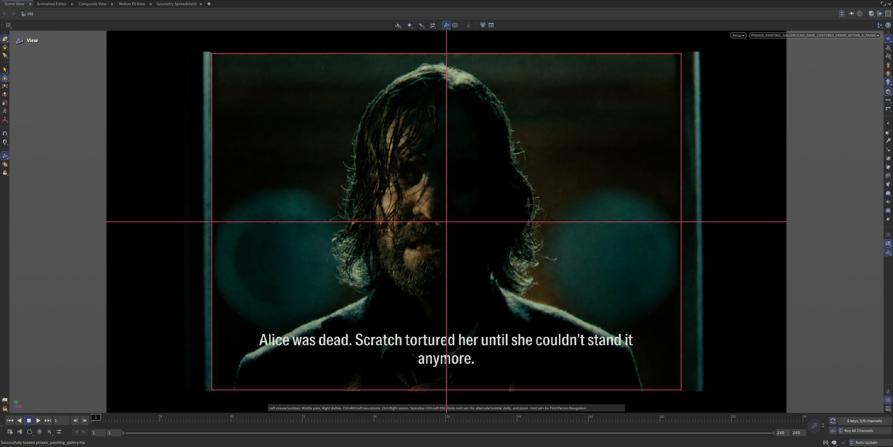

<p align="center"></p>

# PhiAxis

**Composition guides for Houdini's viewport.** Thirds, phi grid, golden spiral, vanishing points,
balance and more, drawn live over your Scene Viewer while you move the camera. Free to use (MIT).

PhiAxis is an overlay: it adds no nodes, changes nothing in your scene, and never appears in a render.

**Get it:** free from the [latest GitHub release](../../releases/latest), or on
[Gumroad](https://noahkarim.gumroad.com/l/kesgnv) (pay what you want, from $0; a dollar is a nice thank-you).
It is the same download in both places.



| | |
| --- | --- |
|  |  |
| *A posed rig over a film still, rule of thirds* | *Golden spiral over a Solaris camera view* |
|  |  |
| *Central symmetry* | *Centered composition* |
|  |  |
| *Leading lines* | *Rule of thirds* |
|  |  |
| *Balance, symmetry and centered composition combined* | *Centered frame within a frame* |

*Screenshots of PhiAxis running in Houdini, drawing its guides over reference frames. The guides illustrate how each one
looks over an image and do not claim the filmmakers or game artists used that construction. Credits for the reference
frames are [below](#license-and-credits).*

## What you get

- **24 guides** that combine freely: rule of thirds, phi grid, golden spiral, golden rectangles and triangle,
  dynamic symmetry (root-2 to root-5 and root-phi), diagonals, center lines, safe area, radiating grid,
  tunnel, vanishing point, leading lines, pyramid, V / L / S / C shapes, circle, balance and asymmetric balance.
  See [GUIDE_TYPES.md](GUIDE_TYPES.md).
- **Follows your camera.** Guides fit the real camera frame: screen windows, orthographic cameras,
  non-square pixels, quad views, floating viewers and Solaris cameras.
- **Presets and styles.** Photography, Cinematography, Portrait and Landscape presets, your own saved
  presets, and a color, opacity, thickness and line style for every guide.
- **Glow and color schemes.** An optional soft glow around every line, with an amount from 0 to 200%, and
  four ready-made color schemes that give each family of guides its own hue (grids, golden-ratio guides,
  perspective, shapes) instead of shades of one color. Both live in the Style tab; glow is off until you
  turn it on.
- **Never in the way.** Clicks, selection and camera moves pass straight through the overlay.
- Works with **Houdini 20.5, 21.0 and 22.0** on Windows.

## How it works

**1. Overlay**

- It uses SideFX's documented `hou.qt.ViewerOverlay`, a transparent window attached to the Scene Viewer.
- Mouse input passes straight through it, so clicks and camera moves still reach Houdini.
- It creates no nodes and never appears in a render. It uses only documented Houdini APIs.

**2. Finding the frame**

- `adapter.py` asks Houdini for the viewport's geometry. Houdini reports it with the origin at the bottom left and
  Qt uses the top left, so PhiAxis converts once.
- If a camera is active, it projects the camera's real frame into screen pixels, including the screen window,
  orthographic cameras, non-square pixels and Solaris cameras. Without a camera it uses the whole viewport.
- It never multiplies by the screen's DPI scale, because Qt's painter already does that. So if your screen is
  scaled to 150% or 200%, the overlay holds stable.

**3. Guide geometry**

- `guides.py` is pure Python with no Houdini or Qt. It takes a rectangle and returns lines, polylines and ellipses
  for each guide: thirds, the golden spiral built from true quarter-circle arcs, dynamic symmetry, vanishing points,
  balance and so on.
- Because it is pure Python, the maths is tested with plain Python, without Houdini. So it is accurate, stays out of
  the way and is not affected by your active Houdini scene.

**4. Painting**

- `overlay.py` loops over the enabled guides and draws them with QPainter.
- With glow on, it first draws a few wide, faint strokes added to the picture, then a lighter, narrower core on top.
  `glow.py` holds that maths.

**5. Settings and style**

- `settings.py` holds a frozen dataclass, validated when it is created, saved as versioned JSON in your preferences
  folder.
- Presets choose which guides show. Style fields cover color, opacity, thickness, line style, per-guide styles, glow,
  and the color schemes from `schemes.py`.

## Install (about a minute)

1. Download **PhiAxis-x.y.z.zip** from the [latest release](../../releases/latest) and unzip it anywhere.
2. Double-click **Install PhiAxis.cmd**.
3. Restart Houdini, then add the shelf: shelf **+** menu, **Shelves**, **PhiAxis**.

It sets PhiAxis up for every Houdini 20.5 to 22 you have used, needs no administrator rights and copies
nothing into Houdini itself. Details, options and uninstalling: [INSTALL.md](INSTALL.md).

## Update

Click **Check for Updates** on the PhiAxis shelf (or in the Guide Settings panel). It shows what is new and installs
after you confirm; it only runs when you click, and the download is verified against a checksum. Your settings and
presets are kept. You can also just run the new release's installer again.

## Using it

Open **Guide Settings**, tick the guides you want, and look through your camera. In quad view hover a viewport and
press Space+N to choose it, or set Coverage to all visible viewports. A few notes:

- The golden spiral and golden rectangle are 1.618 : 1. In a 16:9 frame they fit inside it with a gap at the sides;
  for a frame that fills, set the camera's aspect ratio to 1.618 : 1. In Solaris the viewport frame follows the
  **Camera LOP's aspect ratio**, not the Render Settings resolution.
- Guides are a way to see what a composition is doing, not rules. Plenty of great frames break them on purpose.

## Troubleshooting

Open Houdini's Python Shell and run `import composition_guides as cg; print(cg.diagnostics())`, then attach the output
to an [issue](../../issues) together with your Houdini version.

## Development

```
python -m unittest discover -s tests -p "test_*.py"     # plain-Python tests (guide geometry, settings, updater, release)
python tools/make_release.py                              # builds dist/PhiAxis-<version>.zip and version.json
```

Releases are built by GitHub Actions when a version tag is pushed (see [INSTALL.md](INSTALL.md)). Contributions are welcome;
please run the tests first.

## License and credits

PhiAxis is copyright © 2026 AbdulKarim Noah, released under the [MIT License](LICENSE). It is also available on [Gumroad](https://noahkarim.gumroad.com/l/kesgnv). Houdini is a trademark of Side Effects Software Inc.; PhiAxis is not affiliated
with or endorsed by SideFX.

Reference frames in the screenshots belong to their owners and are shown only to illustrate how the
guides look over real compositions. They are not part of PhiAxis and are not covered by its license; they will be
removed on request.

- Rule of thirds, leading lines and the rig-over-film-still screenshot use stills from *Blade Runner* (1982, directed by
  Ridley Scott; The Ladd Company / Warner Bros.).
- Centered frame within a frame, central symmetry, centered composition and the combined balance shot use screenshots from *Alan Wake 2*
  (Remedy Entertainment; published by Epic Games Publishing).
- The posed figure is SideFX's Electra test character that ships with Houdini.
- The Solaris camera view screenshot shows PhiAxis over a work-in-progress scene.
- The first screenshot shows PhiAxis's glow and color scheme over the viewport grid in Houdini 22.
