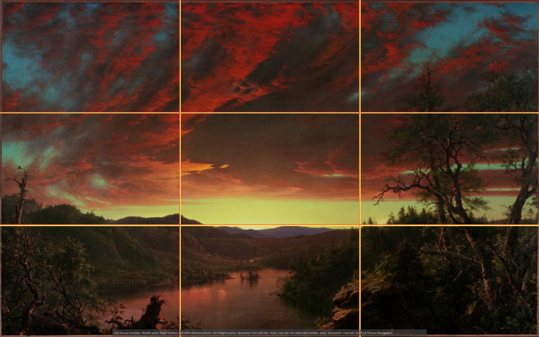
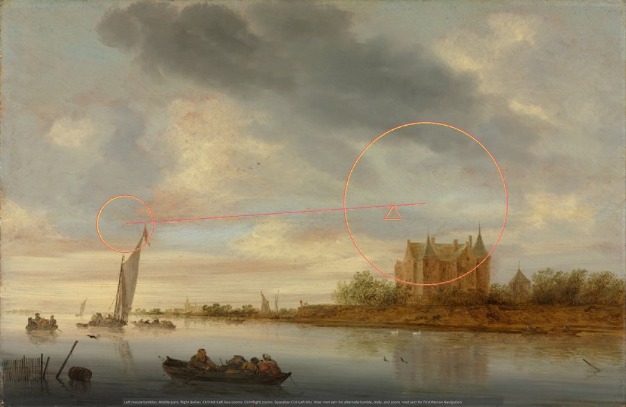
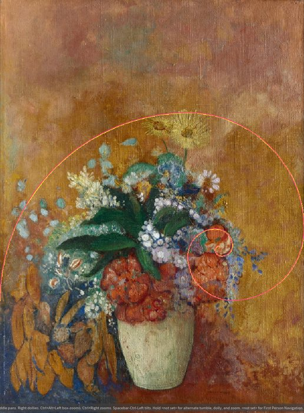
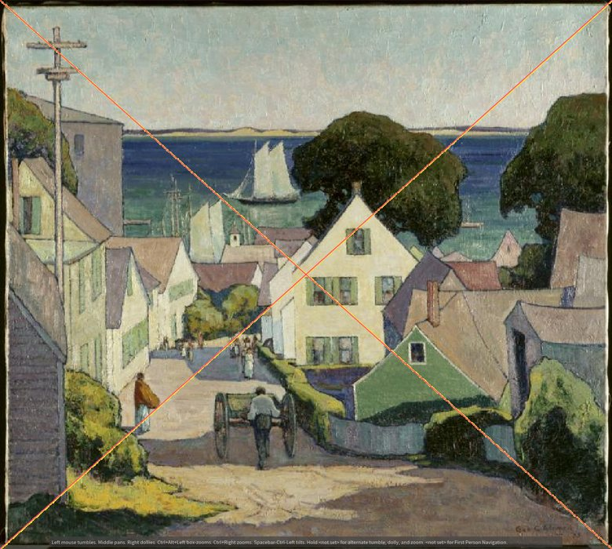

# PhiAxis

**Composition guides for Houdini's viewport.** Thirds, phi grid, golden spiral, vanishing points,
balance and more, drawn live over your Scene Viewer while you move the camera. Free to use (MIT).

PhiAxis is an overlay: it adds no nodes, changes nothing in your scene, and never appears in a render.

| | |
| --- | --- |
|  |  |
|  |  |

*Guides drawn by PhiAxis over public-domain paintings. Rule of thirds, golden spiral, vanishing point and asymmetric balance are shown;
the guides illustrate how each one looks over art and do not claim the painter used that construction.*

## What you get

- **24 guides** that combine freely: rule of thirds, phi grid, golden spiral, golden rectangles and triangle,
  dynamic symmetry (root-2 to root-5 and root-phi), diagonals, center lines, safe area, radiating grid,
  tunnel, vanishing point, leading lines, pyramid, V / L / S / C shapes, circle, balance and asymmetric balance.
  See [GUIDE_TYPES.md](GUIDE_TYPES.md).
- **Follows your camera.** Guides fit the real camera frame: screen windows, orthographic cameras,
  non-square pixels, quad views, floating viewers and Solaris cameras.
- **Presets and styles.** Photography, Cinematography, Portrait and Landscape presets, your own saved
  presets, and a color, opacity, thickness and line style for every guide.
- **Never in the way.** Clicks, selection and camera moves pass straight through the overlay.
- Works with **Houdini 20.5, 21.0 and 22.0** on Windows.

## Install (about a minute)

1. Download **PhiAxis-x.y.z.zip** from the [latest release](../../releases/latest) and unzip it anywhere.
2. Double-click **Install PhiAxis.cmd**.
3. Restart Houdini, then add the shelf: shelf **+** menu, **Shelves**, **PhiAxis**.

It sets PhiAxis up for every Houdini 20.5 to 22 you have used, needs no administrator rights and copies
nothing into Houdini itself. Details, options and uninstalling: [INSTALL.md](INSTALL.md).

## Update

Click **Check for Updates** on the PhiAxis shelf (or in the Guide Settings panel). It shows what is new and installs
after you confirm; it only runs when you click, and the download is verified against a checksum. Your settings and
presets are kept. You can also just run the new release's installer again.

## Using it

Open **Guide Settings**, tick the guides you want, and look through your camera. In quad view hover a viewport and
press Space+N to choose it, or set Coverage to all visible viewports. A few notes:

- The golden spiral and golden rectangle are 1.618 : 1. In a 16:9 frame they fit inside it with a gap at the sides;
  for a frame that fills, set the camera's aspect ratio to 1.618 : 1. In Solaris the viewport frame follows the
  **Camera LOP's aspect ratio**, not the Render Settings resolution.
- Guides are a way to see what a composition is doing, not rules. Plenty of great frames break them on purpose.

## Troubleshooting

Open Houdini's Python Shell and run `import composition_guides as cg; print(cg.diagnostics())`, then attach the output
to an [issue](../../issues) together with your Houdini version.

## Development

```
python -m unittest discover -s tests -p "test_*.py"     # plain-Python tests (guide geometry, settings, updater, release)
python tools/make_release.py                              # builds dist/PhiAxis-<version>.zip and version.json
```

Releases are built by GitHub Actions when a version tag is pushed (see [INSTALL.md](INSTALL.md)). Contributions are welcome;
please run the tests first.

## License and credits

PhiAxis is released under the [MIT License](LICENSE). Houdini is a trademark of Side Effects Software Inc.; PhiAxis is not affiliated
with or endorsed by SideFX.

Preview paintings, all CC0 from the Cleveland Museum of Art Open Access collection:
- Rule of thirds: *Twilight in the Wilderness*, Frederic Edwin Church (American, 1826–1900) (Cleveland Museum of Art, CC0)
- Golden spiral: *Vase of Flowers*, Odilon Redon (French, 1840–1916) (Cleveland Museum of Art, CC0)
- Vanishing point: *Down to the Harbor*, George G. Adomeit (American, born Kingdom of Prussia [now Lithuania], 1879–1967) (Cleveland Museum of Art, CC0)
- Asymmetric balance: *Castle on a River*, Salomon van Ruysdael (Dutch, 1602–1670) (Cleveland Museum of Art, CC0)
